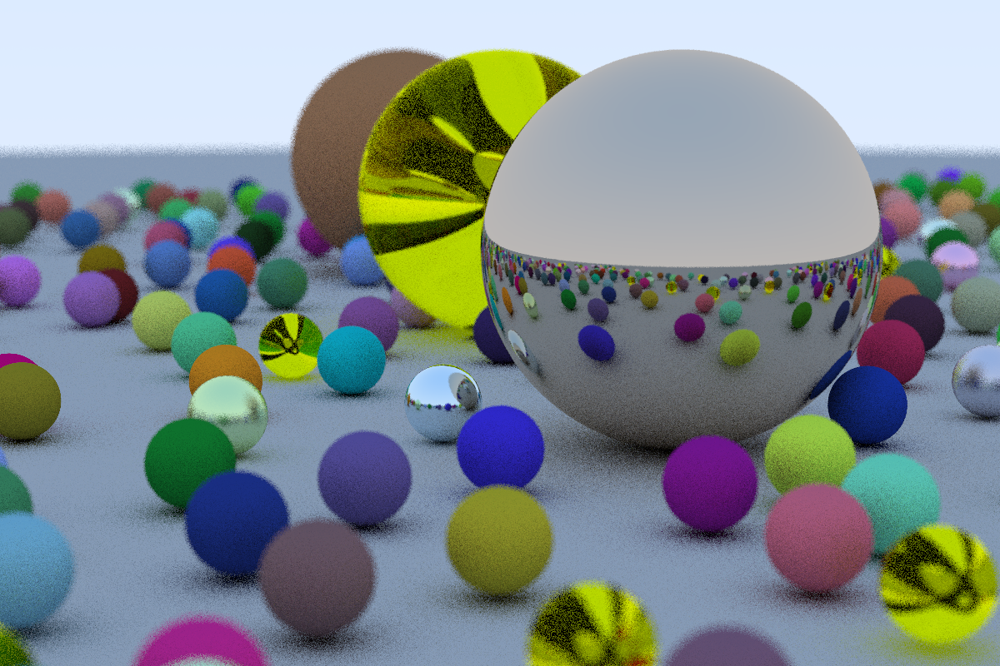

# A Simple Raytracer

I built a raytracer following Peter Shirley's ["Ray Tracing in One Weekend"](https://www.amazon.com/dp/B01B5AODD8). Basic reflection and refraction are implemented, as well as a positionable camera and depth of field.

TODO:
1. Dielectrics look weird.
2. Implement textures.

